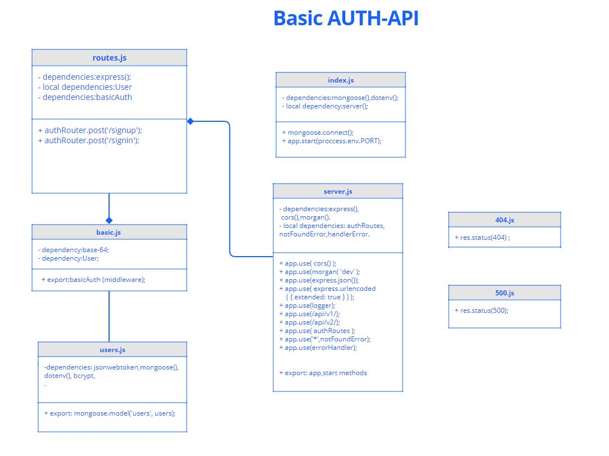

# basic-auth
## Author: Tamara Alrashed

### [Deployment](https://tamara--basic-auth.herokuapp.com/)
### [Tests report](https://github.com/Tamaraalrashed/basic-auth/actions/workflows/node.js.yml)
### [Submission PR](https://github.com/Tamaraalrashed/basic-auth/pull/1)

## Setup
`.env`  requirements 
`PORT` - Port Number  

## Running the app  

- `npm start`  
- End points: 
   - /api/v1/signup(POST)
   - /api/v1/signin(POST)

## Tests
Unit Tests: `npm run test`

## UML

